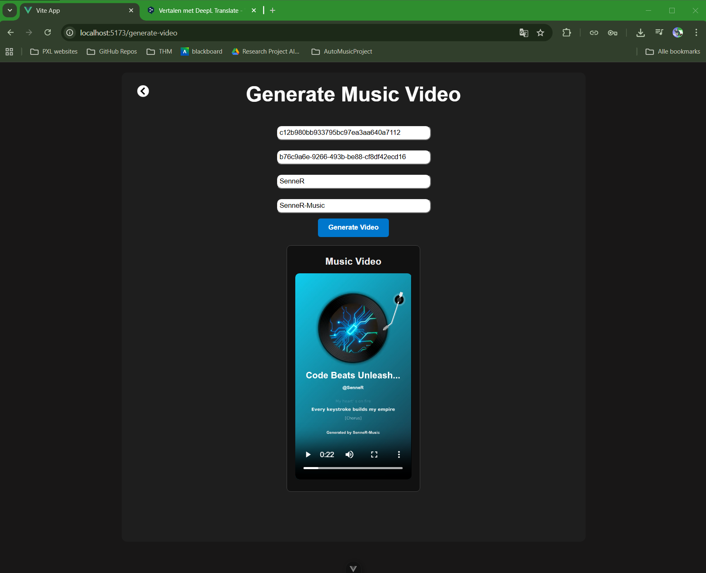

# AutoMusicProject 🎵🤖

[GitHub Repository](https://github.com/sennereekmans/AutoMusicProject)

AutoMusicProject is a modern web application that allows users to generate complete music productions, from **lyrics to music video**, fully automated using AI models from [Suno API](https://sunoapi.org/). The project combines state-of-the-art web development with powerful AI integrations and is designed to provide a smooth, interactive experience.

---

## Features

- **Lyrics Generation:** Create unique song lyrics based on a topic of your choice.
- **Song Creation:** Generate a complete song using the generated lyrics and select your preferred music genre.
- **Music Video Generation:** Automatically create a matching music video for your song.
- **Credit Management:** Check your remaining Suno account credits to manage usage.

---

## Technologies

AutoMusicProject is built with a modern and scalable tech stack:

- **Backend:** Python with FastAPI for a fast and reliable API.
- **Frontend:** Vue.js for an interactive and dynamic user experience.
- **HTTP Requests:** Axios for communication between frontend and backend.
- **Containerization:** Docker for easy deployment and consistent development environment.
- **AI Integration:** Suno API for leveraging powerful music and video models.

---

## How the Application Works (Normal Flow)

1. **Lyrics Generation**  
   - The user inputs a topic for the song.  
   - The backend sends the prompt to the Suno API and receives the generated lyrics.
   - 
2. **Song Creation**  
   - Based on the lyrics, the user selects a music genre.  
   - The backend generates the song using the selected genre and lyrics.
   - 
   - 
   - 

3. **Music Video Generation**  
   - With the generated song, the user can create a music video.  
   - The video is generated via the Suno API and can be viewed immediately.
   - 

4. **Credit Management**  
   - The user can check remaining Suno API credits to keep track of usage.
   - - 

---

## Installation and Setup

```bash
git clone https://github.com/sennereekmans/AutoMusicProject.git
cd AutoMusicProject
docker-compose up --build
```
